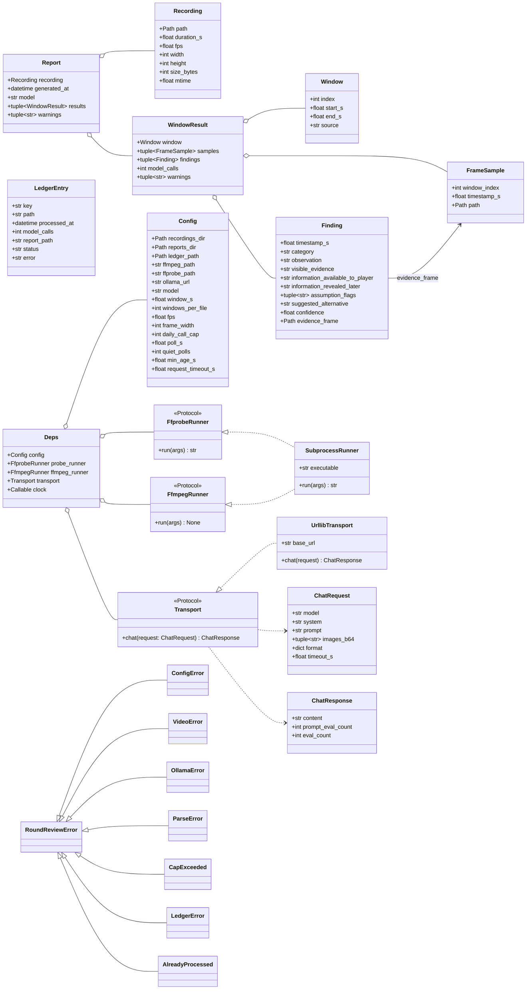

# Class diagram

Data is immutable (`@dataclass(frozen=True, slots=True)`). External systems sit behind `Protocol`s so tests inject fakes. There are no service classes; each module exposes pure functions that take their dependencies as arguments. `Deps` bundles the injected dependencies for the pipeline.

## Module map

| Module | Owns | Key functions |
| --- | --- | --- |
| `config` | `Config` | `load_config(path, env)`, `default_config_path()` |
| `ledger` | `LedgerEntry` | `read_ledger`, `append_entry`, `is_processed`, `calls_today`, `recording_key` |
| `video.probe` | `Recording`, `FfprobeRunner` | `probe(path, runner)`, `parse_probe_json` |
| `video.windows` | `Window` | `select_windows(duration_s, window_s, count, edge_skip_s)` |
| `video.frames` | `FrameSample`, `FfmpegRunner` | `build_extract_args`, `extract_frames`, `encode_frame_b64` |
| `llm.transport` | `ChatRequest`, `ChatResponse`, `Transport`, `UrllibTransport` | `UrllibTransport.chat` |
| `llm.client` | | `build_chat_request`, `send_review(request, transport, calls_today, cap)` |
| `coaching.prompt` | `SYSTEM_PROMPT`, `FINDING_SCHEMA` | `build_user_prompt(window, samples)` |
| `coaching.parse` | `Finding` | `parse_findings(text, window)`, `extract_json(text)` |
| `coaching.review` | `WindowResult` | `review_window(window, samples, deps, calls_so_far)` |
| `report.markdown` | `Report` | `render_report`, `write_report` |
| `pipeline` | `Deps` | `review_file(path, deps)`, `make_default_deps(config)` |
| `watcher` | `FileSnapshot`, `WatchState` | `poll_once`, `is_stable`, `watch_loop` |
| `cli` | | `main` (click group) |
| `errors` | exception hierarchy | |
