# Class diagram

Data is immutable (`@dataclass(frozen=True, slots=True)`). External systems sit behind `Protocol`s so tests inject fakes. There are no service classes; each module exposes pure functions that take their dependencies as arguments. `Deps` bundles the injected dependencies for the pipeline.

```mermaid
classDiagram
    direction LR

    class Config {
        +Path recordings_dir
        +Path reports_dir
        +Path ledger_path
        +str ffmpeg_path
        +str ffprobe_path
        +str ollama_url
        +str model
        +int num_ctx
        +float window_s
        +int windows_per_file
        +float fps
        +int frame_width
        +int daily_call_cap
        +float poll_s
        +int quiet_polls
        +float min_age_s
        +float request_timeout_s
    }

    class Recording {
        +Path path
        +float duration_s
        +float fps
        +int width
        +int height
        +int size_bytes
        +float mtime
    }

    class Window {
        +int index
        +float start_s
        +float end_s
        +str source
    }

    class FrameSample {
        +int window_index
        +float timestamp_s
        +Path path
    }

    class Finding {
        +float timestamp_s
        +str check_id
        +str category
        +str observation
        +str visible_evidence
        +str information_available_to_player
        +str information_revealed_later
        +tuple~str~ assumption_flags
        +str suggested_alternative
        +float confidence
        +Path evidence_frame
    }

    class WindowResult {
        +Window window
        +tuple~FrameSample~ samples
        +tuple~Finding~ findings
        +int model_calls
        +tuple~str~ warnings
        +Situation situation
        +PlayerContext context
    }

    class Report {
        +Recording recording
        +datetime generated_at
        +str model
        +tuple~WindowResult~ results
        +tuple~str~ warnings
    }

    class LedgerEntry {
        +str key
        +str path
        +datetime processed_at
        +int model_calls
        +str report_path
        +str status
        +str error
    }

    class ChatRequest {
        +str model
        +str system
        +str prompt
        +tuple~str~ images_b64
        +dict format
        +float timeout_s
    }

    class ChatResponse {
        +str content
        +int prompt_eval_count
        +int eval_count
    }

    class FfprobeRunner {
        <<Protocol>>
        +run(args) str
    }
    class FfmpegRunner {
        <<Protocol>>
        +run(args) None
    }
    class Transport {
        <<Protocol>>
        +chat(request: ChatRequest) ChatResponse
    }
    class UrllibTransport {
        +str base_url
        +int num_ctx
        +chat(request) ChatResponse
    }
    class SubprocessRunner {
        +str executable
        +run(args) str
    }

    class Job {
        +str id
        +Path path
        +str key
        +str status
        +int windows_done
        +int windows_total
        +str error
        +datetime created_at
        +datetime finished_at
    }

    class JobQueue {
        +submit(path, key) Job
        +get(job_id) Job
        +list() list~Job~
        +start()
        +stop()
        +wait_idle(timeout) bool
    }

    class PlayerContext {
        +str rank
        +str agent
        +str map
        +str side
        +str focus
        +str notes
        +describe() str
    }

    class Situation {
        +str agent
        +str map
        +str side
        +str phase
        +str weapon
        +tuple~str~ abilities_available
        +int credits
        +int teammates_alive
        +int enemies_visible
        +tuple timeline
        +str summary
        +to_context() PlayerContext
    }

    class CoachingKnowledge {
        +Checklist checklist
        +Mapping~AgentBrief~ agents
        +Mapping~MapBrief~ maps
    }
    class Checklist {
        +tuple~Category~ categories
        +Mapping rank_expectations
        +check_ids() frozenset
    }
    class Category {
        +str id
        +str name
        +str principle
        +tuple~Check~ checks
    }
    class Check {
        +str id
        +str check
        +str common_mistake
        +str fix
        +bool visible_in_frames
    }
    class AgentBrief {
        +str id
        +str name
        +str role
        +tuple abilities
        +str job_in_round
        +tuple~str~ common_mistakes
        +tuple~str~ ability_checks
    }
    class MapBrief {
        +str id
        +str name
        +tuple~str~ sites
        +tuple~str~ key_callouts
        +tuple~str~ common_mistakes
    }

    class SceneCase {
        +Path clip
        +float timestamp_s
        +str expected_phase
        +str expected_agent
        +str expected_map
    }
    class SceneOutcome {
        +SceneCase case
        +Situation situation
        +str error
        +Path frame
        +detected_phase() str
        +phase_ok() bool
    }
    class SceneReport {
        +str model
        +int frames_per_case
        +accuracy() float
        +confusion() dict
        +collapsed_to() str
    }

    class JobOptions {
        +bool force
        +str coverage
        +float max_span_s
        +int max_windows
    }

    class Deps {
        +Config config
        +FfprobeRunner probe_runner
        +FfmpegRunner ffmpeg_runner
        +Transport transport
        +Callable clock
    }

    class RoundReviewError
    class ConfigError
    class VideoError
    class OllamaError
    class ParseError
    class CapExceeded
    class LedgerError
    class AlreadyProcessed
    class KnowledgeError
    class LabelsError

    Transport <|.. UrllibTransport
    FfprobeRunner <|.. SubprocessRunner
    FfmpegRunner <|.. SubprocessRunner
    Deps o-- Config
    Deps o-- FfprobeRunner
    Deps o-- FfmpegRunner
    Deps o-- Transport
    JobQueue o-- Job
    Job o-- JobOptions
    SceneReport o-- SceneOutcome
    SceneOutcome o-- SceneCase
    SceneOutcome ..> Situation
    RoundReviewError <|-- LabelsError
    JobQueue ..> Deps : run callable
    Report o-- Recording
    Report o-- WindowResult
    WindowResult o-- Window
    WindowResult o-- FrameSample
    WindowResult o-- Finding
    Finding --> FrameSample : evidence_frame
    WindowResult o-- Situation
    WindowResult o-- PlayerContext
    CoachingKnowledge o-- Checklist
    CoachingKnowledge o-- AgentBrief
    CoachingKnowledge o-- MapBrief
    Checklist o-- Category
    Category o-- Check
    Finding ..> Check : check_id
    Situation ..> PlayerContext : to_context
    RoundReviewError <|-- KnowledgeError
    Transport ..> ChatRequest
    Transport ..> ChatResponse
    RoundReviewError <|-- ConfigError
    RoundReviewError <|-- VideoError
    RoundReviewError <|-- OllamaError
    RoundReviewError <|-- ParseError
    RoundReviewError <|-- CapExceeded
    RoundReviewError <|-- LedgerError
    RoundReviewError <|-- AlreadyProcessed
```

## Module map

| Module | Owns | Key functions |
| --- | --- | --- |
| `config` | `Config` | `load_config(path, env)`, `default_config_path()` |
| `ledger` | `LedgerEntry` | `read_ledger`, `append_entry`, `is_processed`, `calls_today`, `recording_key` |
| `video.probe` | `Recording`, `FfprobeRunner` | `probe(path, runner)`, `parse_probe_json` |
| `video.windows` | `Window` | `plan_windows(coverage=...)`, `tile_windows` (full coverage), `select_windows` (evenly spread), `estimate_window_count` |
| `video.frames` | `FrameSample`, `FfmpegRunner` | `build_extract_args`, `extract_frames`, `extract_single_frame`, `encode_frame_b64` |
| `llm.transport` | `ChatRequest`, `ChatResponse`, `Transport`, `UrllibTransport` | `UrllibTransport.chat` |
| `llm.client` | | `build_chat_request`, `send_review(request, transport, calls_today, cap)` |
| `coaching.knowledge` | `CoachingKnowledge`, `Checklist`, `AgentBrief`, `MapBrief` | `load_knowledge`, `find_agent`, `find_map`, `render_checklist(categories)`, `render_agent_brief`, `render_map_brief`, `render_rank_focus`, `relevant_categories(phase)` |
| `coaching.context` | `PlayerContext` | `context_from_mapping`, `merge_context` |
| `coaching.situation` | `Situation` | `parse_situation` |
| `coaching.prompt` | `FINDING_SCHEMA`, `SITUATION_SCHEMA` | `build_system_prompt(knowledge, phase)`, `build_situation_prompt`, `build_coach_prompt` |
| `coaching.parse` | `Finding` | `parse_findings(text, window)`, `extract_json(text)` |
| `coaching.review` | `WindowResult` | `review_window(..., context, knowledge, situation_pass)`: pass 1 situation, pass 2 coach with one retry |
| `report.markdown` | `Report` | `render_report`, `write_report` |
| `pipeline` | `Deps` | `review_file(path, deps, on_progress)`, `make_default_deps(config)`, `key_for(path)`, `report_dir_for(config, path)` |
| `report.json_report` | | `report_to_dict`, `write_report_json`, `load_report_json` |
| `server.jobs` | `Job`, `JobOptions`, `JobQueue` | single worker thread; `submit` dedups queued/running paths and carries per-job force/coverage |
| `server.app` | | `create_app(config, jobs, probe_runner)`: `/api/clips` (with durations and window estimates), `/api/jobs` (force + coverage), `/api/settings`, `/api/knowledge`, `/api/reports/{key}`, `/api/media/...` |
| `validation.scenes` | `SceneCase`, `SceneOutcome`, `SceneReport` | `scaffold_cases`, `load_cases`, `run_cases`, `render_scene_report`: scene recognition scored on its own |
| `watcher` | `FileSnapshot`, `WatchState` | `poll_once`, `is_stable`, `watch_loop` |
| `cli` | | `main` (click group) |
| `errors` | exception hierarchy | |
