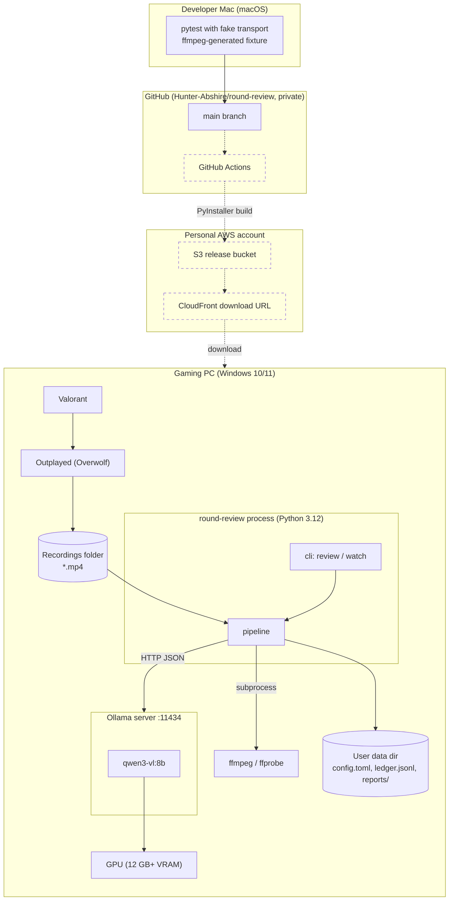

# Deployment diagram

Solid nodes exist in 0.1. Dashed nodes are the planned distribution path (GitHub Actions in the personal AWS account building a downloadable Windows bundle). Nothing in 0.1 depends on the dashed nodes.

## Node notes

| Node | Detail |
| --- | --- |
| round-review process | Single process, single thread, polling watcher. Installed via `pip install` in 0.1; PyInstaller bundle later. |
| ffmpeg / ffprobe | Required on PATH or set via `ffmpeg_path` / `ffprobe_path`. Bundled with the future installer. |
| Ollama server | Installed separately by the player. Must have the configured model pulled. |
| User data dir | Resolved with `platformdirs` (`%LOCALAPPDATA%\round-review` on Windows, `~/Library/Application Support/round-review` on macOS). |
| GitHub Actions / S3 / CloudFront | Not built. Kept here so the CLI and packaging layout stay compatible. |
