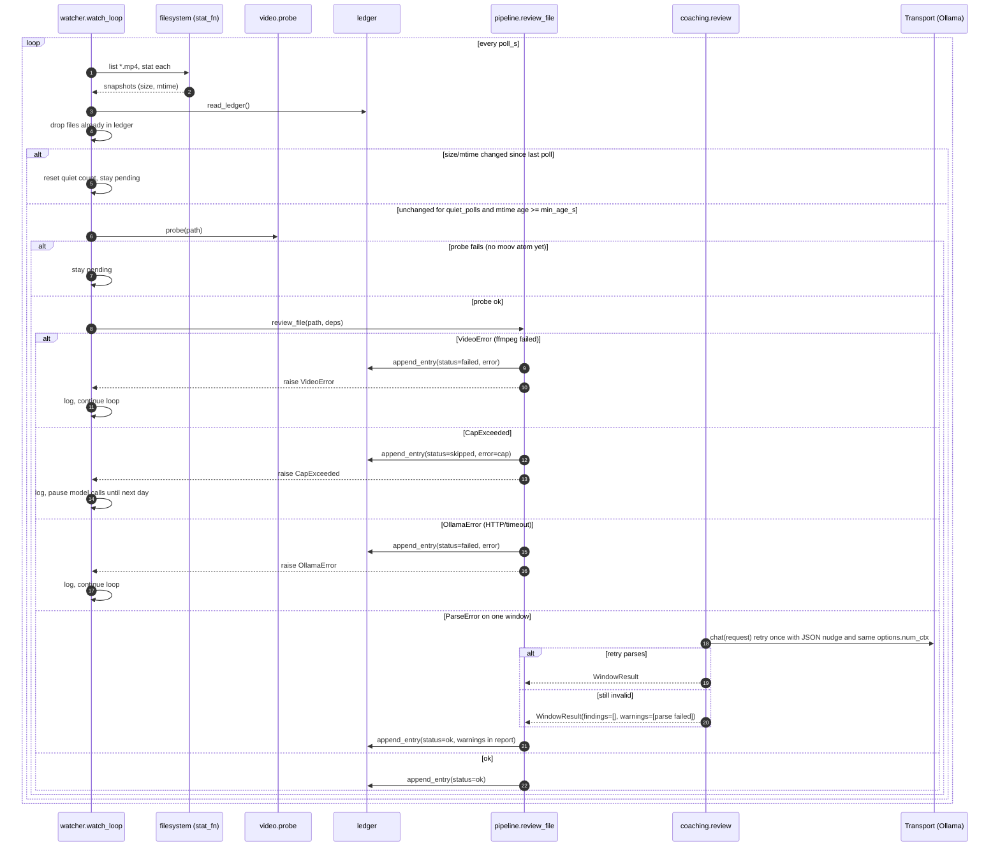
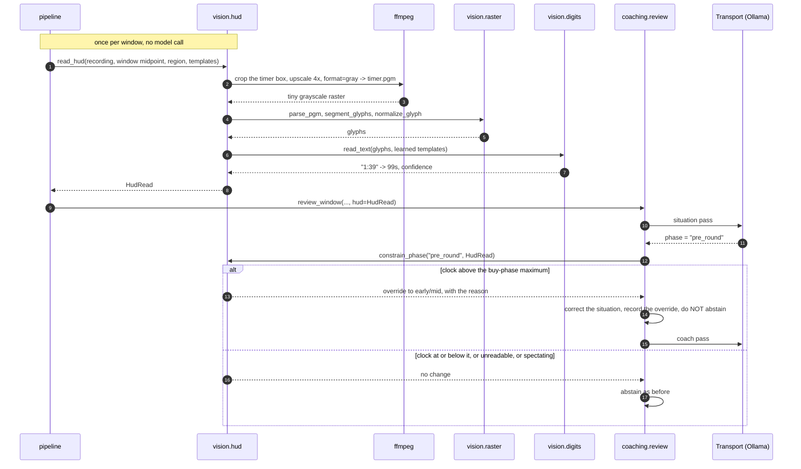
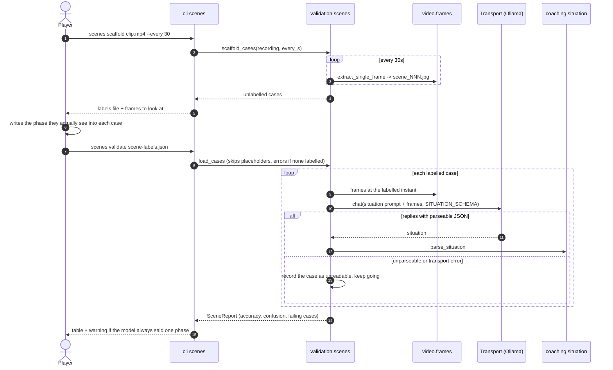

# Sequence diagrams

## 1. `round-review review <file>` happy path

```mermaid
sequenceDiagram
    autonumber
    actor Player
    participant CLI as cli
    participant P as pipeline.review_file
    participant L as ledger
    participant Probe as video.probe
    participant Win as video.windows
    participant Fr as video.frames
    participant Rev as coaching.review
    participant Cl as llm.client
    participant T as Transport (Ollama)
    participant Pa as coaching.parse
    participant Rep as report.markdown

    Player->>CLI: review clip.mp4
    CLI->>P: review_file(path, deps)
    P->>L: read_ledger()
    L-->>P: entries
    P->>P: is_processed? no
    P->>Probe: probe(path, ffprobe_runner)
    Probe-->>P: Recording(duration, fps, w, h)
    P->>Win: select_windows(duration, window_s, count)
    Win-->>P: [Window x3]
    loop each Window
        P->>Fr: extract_frames(recording, window, ffmpeg_runner, out_dir)
        Fr-->>P: [FrameSample x12]
        P->>Rev: review_window(window, samples, deps, calls_so_far)
        Rev->>Cl: build_chat_request(model, prompt, images)
        Rev->>Cl: send_review(request, transport, calls_today, cap)
        Cl->>Cl: cap check
        Cl->>T: chat(request) POST /api/chat with configured options.num_ctx
        Note over T: think=false; completed JSON-only thinking fallback is logged and validated normally
        T-->>Cl: ChatResponse(content=json)
        Cl-->>Rev: content
        Rev->>Pa: parse_findings(content, window)
        Pa-->>Rev: [Finding]
        Rev-->>P: WindowResult
    end
    P->>Rep: write_report(Report, reports_dir)
    Rep-->>P: report_path
    P->>L: append_entry(status=ok, model_calls, report_path)
    P-->>CLI: Report
    CLI-->>Player: prints report path, exit 0
```

## 2. Watcher: stability, review, failure branches



## 3. Two-pass window review

```mermaid
sequenceDiagram
    autonumber
    participant P as pipeline.review_file
    participant R as coaching.review.review_window
    participant K as coaching.knowledge
    participant T as Transport (Ollama)
    participant S as coaching.situation
    participant Pa as coaching.parse
    participant Fr as video.frames

    P->>R: review_window(window, samples, context, knowledge, situation_pass)
    opt situation_pass
        R->>T: chat(SITUATION_SYSTEM_PROMPT + captions + images, SITUATION_SCHEMA)
        T-->>R: JSON (agent, map, side, phase, HUD state, timeline, summary)
        R->>S: parse_situation
        alt parses
            R->>R: context = merge(user context, detected)
        else unparseable
            R->>R: warning, continue without situation
        end
    end
    R->>K: relevant_categories(phase), find_agent, find_map, render_rank_focus
    Note over R: Detected buy phase, spectating or unreadable phase returns no findings with a note; no coach call
    R->>T: chat(system = persona + rules + filtered checklist; user = context + briefs + situation + captions, FINDING_SCHEMA)
    T-->>R: JSON findings with check_id
    R->>Pa: parse_findings(text, window, samples, known check ids)
    Pa-->>R: findings (unknown check_id -> "other" + warning)
    Note over Pa: Restore rounded frame captions to exact sample times before bounds validation
    R->>R: reject phase-inappropriate checks and crosshair criticism without an equipped firearm
    R-->>P: WindowResult(findings, situation, context, model_calls)
    loop each finding
        P->>Fr: extract_single_frame(recording, timestamp_s) -> frames/eWW_NN.jpg
        Fr-->>P: exact evidence frame (or VideoError -> keep sampled frame + warning)
    end
```

## 4. Deterministic HUD veto



## 5. Scene-recognition validation



## 6. Desktop: Analyze a clip and view markers

```mermaid
sequenceDiagram
    autonumber
    actor Player
    participant R as Electron renderer
    participant M as Electron main
    participant API as FastAPI (127.0.0.1)
    participant Q as JobQueue worker
    participant P as pipeline.review_file

    M->>API: spawn `round-review serve --port 8765`
    M->>API: GET /api/health (retry until 200)
    R->>API: GET /api/clips
    API-->>R: [{name, key, status: new|queued|running|done|failed|skipped}]
    Player->>R: click Analyze on clip
    R->>API: POST /api/jobs {path, context, force, coverage, max_span_s, max_windows}
    API->>Q: submit(path, key, context, options)
    API-->>R: 202 {id, status: queued}
    Q->>P: review_file(path, deps, on_progress)
    loop every 2 s until done/failed
        R->>API: GET /api/jobs/{id}
        P-->>Q: on_progress(done, total)
        API-->>R: {status: running, windows_done, windows_total}
    end
    P-->>Q: Report (report.md + report.json written)
    R->>API: GET /api/reports/{key}
    API-->>R: report.json
    R->>API: GET /api/media/{key}/video (Range)
    API-->>R: 206 partial MP4
    R->>R: draw one marker per finding at timestamp_s / duration_s
    R->>R: show sampled coverage, review notes and separately selectable findings
    Player->>R: click marker
    R->>R: video.currentTime = timestamp_s; show finding card
    R->>API: GET /api/media/{key}/frames/w01_004.jpg
```

## Failure semantics

| Error | Raised by | Ledger status | `review` exit | `watch` behaviour |
| --- | --- | --- | --- | --- |
| `VideoError` | probe, frames | failed | non-zero | log, continue |
| `OllamaError` | transport | failed | non-zero | log, continue |
| `CapExceeded` | client | skipped | non-zero | log, stop calling the model until the day changes |
| `ParseError` (after retry) | review | ok, with warning | 0 | report written with the window marked as unparseable |
| `LedgerError` | ledger | n/a | non-zero | loop aborts; a corrupt ledger must be fixed by hand |
| `CapExceeded` / `OllamaError` / `VideoError` after >=1 window | pipeline | partial, report written | 0 | the review stops, keeps its findings, and the clip can be re-analyzed |
| `LabelsError` | validation.scenes | n/a | non-zero | scene validation only |
| `HudError` | vision | never fails a review | non-zero from the `hud` commands | an unreadable HUD is simply no evidence |
| `ConfigError` | config | n/a | non-zero | never starts |
| `AlreadyProcessed` | pipeline | n/a (existing entry) | non-zero unless `--force` | never raised; the watcher filters known files first |

HUD learning, CLI reads, scene validation, and pipeline reads all pass the configured
`hud_threshold` to segmentation and glyph normalization. The crop and brightness
cutoff must match those used to learn the digit templates.
