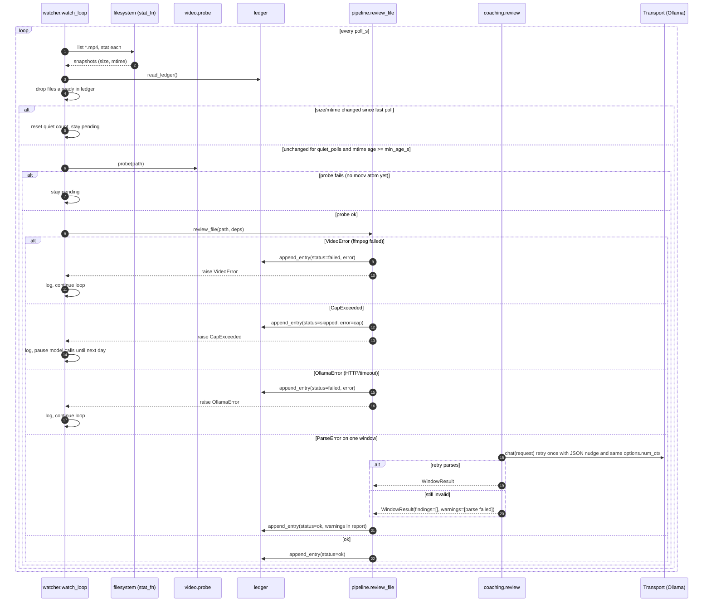

# Sequence diagrams

## 1. `round-review review <file>` happy path

```mermaid
sequenceDiagram
    autonumber
    actor Player
    participant CLI as cli
    participant P as pipeline.review_file
    participant L as ledger
    participant Probe as video.probe
    participant Win as video.windows
    participant Fr as video.frames
    participant Rev as coaching.review
    participant Cl as llm.client
    participant T as Transport (Ollama)
    participant Pa as coaching.parse
    participant Rep as report.markdown

    Player->>CLI: review clip.mp4
    CLI->>P: review_file(path, deps)
    P->>L: read_ledger()
    L-->>P: entries
    P->>P: is_processed? no
    P->>Probe: probe(path, ffprobe_runner)
    Probe-->>P: Recording(duration, fps, w, h)
    P->>Win: select_windows(duration, window_s, count)
    Win-->>P: [Window x3]
    loop each Window
        P->>Fr: extract_frames(recording, window, ffmpeg_runner, out_dir)
        Fr-->>P: [FrameSample x12]
        P->>Rev: review_window(window, samples, deps, calls_so_far)
        Rev->>Cl: build_chat_request(model, prompt, images)
        Rev->>Cl: send_review(request, transport, calls_today, cap)
        Cl->>Cl: cap check
        Cl->>T: chat(request) POST /api/chat with configured options.num_ctx
        Note over T: think=false; completed JSON-only thinking fallback is logged and validated normally
        T-->>Cl: ChatResponse(content=json)
        Cl-->>Rev: content
        Rev->>Pa: parse_findings(content, window)
        Pa-->>Rev: [Finding]
        Rev-->>P: WindowResult
    end
    P->>Rep: write_report(Report, reports_dir)
    Rep-->>P: report_path
    P->>L: append_entry(status=ok, model_calls, report_path)
    P-->>CLI: Report
    CLI-->>Player: prints report path, exit 0
```

## 2. Watcher: stability, review, failure branches



## 3. Desktop: Analyze a clip and view markers

```mermaid
sequenceDiagram
    autonumber
    actor Player
    participant R as Electron renderer
    participant M as Electron main
    participant API as FastAPI (127.0.0.1)
    participant Q as JobQueue worker
    participant P as pipeline.review_file

    M->>API: spawn `round-review serve --port 8765`
    M->>API: GET /api/health (retry until 200)
    R->>API: GET /api/clips
    API-->>R: [{name, key, status: new|queued|running|done|failed|skipped}]
    Player->>R: click Analyze on clip
    R->>API: POST /api/jobs {path}
    API->>Q: submit(path, key)
    API-->>R: 202 {id, status: queued}
    Q->>P: review_file(path, deps, on_progress)
    loop every 2 s until done/failed
        R->>API: GET /api/jobs/{id}
        P-->>Q: on_progress(done, total)
        API-->>R: {status: running, windows_done, windows_total}
    end
    P-->>Q: Report (report.md + report.json written)
    R->>API: GET /api/reports/{key}
    API-->>R: report.json
    R->>API: GET /api/media/{key}/video (Range)
    API-->>R: 206 partial MP4
    R->>R: draw one marker per finding at timestamp_s / duration_s
    Player->>R: click marker
    R->>R: video.currentTime = timestamp_s; show finding card
    R->>API: GET /api/media/{key}/frames/w01_004.jpg
```

## Failure semantics

| Error | Raised by | Ledger status | `review` exit | `watch` behaviour |
| --- | --- | --- | --- | --- |
| `VideoError` | probe, frames | failed | non-zero | log, continue |
| `OllamaError` | transport | failed | non-zero | log, continue |
| `CapExceeded` | client | skipped | non-zero | log, stop calling the model until the day changes |
| `ParseError` (after retry) | review | ok, with warning | 0 | report written with the window marked as unparseable |
| `LedgerError` | ledger | n/a | non-zero | loop aborts; a corrupt ledger must be fixed by hand |
| `ConfigError` | config | n/a | non-zero | never starts |
| `AlreadyProcessed` | pipeline | n/a (existing entry) | non-zero unless `--force` | never raised; the watcher filters known files first |
