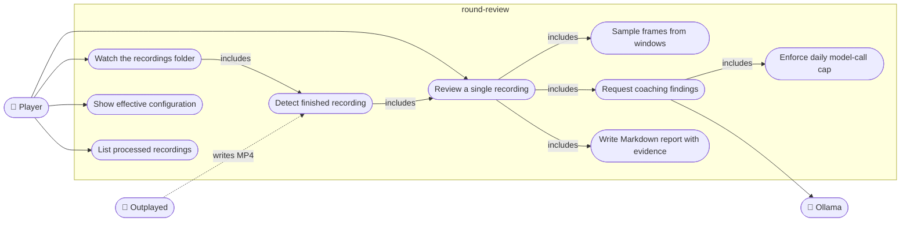

# Use case diagram

Mermaid has no native use-case notation; actors are stick figures rendered as nodes on the left and right, use cases as ellipses, system boundary as a subgraph.

## Use case notes

| Use case | Precondition | Main flow | Failure handling |
| --- | --- | --- | --- |
| Review a single recording | File exists, ffmpeg/ffprobe on PATH, Ollama reachable | probe, select windows, extract frames, review each window, write report, append ledger | `VideoError`, `OllamaError`, `ParseError`, `CapExceeded` exit non-zero with the class name; ledger records `failed`/`skipped` |
| Watch the recordings folder | `recordings_dir` configured | poll; when a file is stable and not in the ledger, run "Review a single recording" | per-file errors are logged and recorded; the loop continues; `CapExceeded` pauses model calls until the next day |
| Detect finished recording | none | size and mtime unchanged for `quiet_polls`, mtime older than `min_age_s`, ffprobe succeeds | not yet stable = stay pending |
| Enforce daily model-call cap | ledger readable | count calls in ledger for today, refuse before the transport is invoked | `CapExceeded` |
